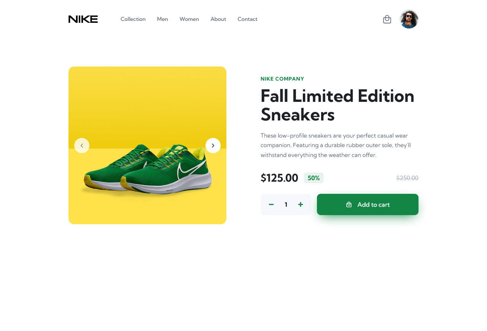

<h1 align="center">Product Detail Page</h1>

## Project Description
Product Detail Page is a mobile-first responsive design Using HTML, CSS, and JavaScript.

## Screenshot 
Desktop Preview 

## Built with 
- Semantic HTML5 markup
- CSS custom properties
- CSS Grid
- Flexbox
- JS

### What I learned 
I have a better understanding of CSS Grid while I was doing this project. 

- JS
  - add event on Element
  - Navigation toggle 
  - Slider Functionality
  - Increase and Decrease Quantity on Product 

### Acknowledgments
This [YouTube Tutorial](https://www.youtube.com/watch?v=0O3yFSEujrw) was amazing and very detaild explain everything step by step.
